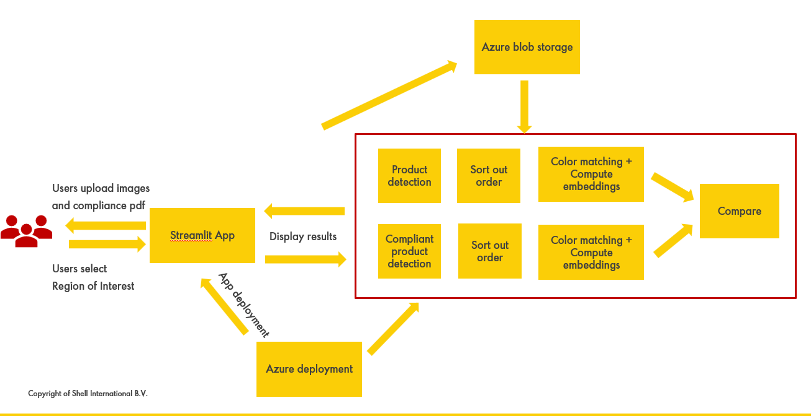

# Planogram Compliance Check

This application allows users to upload Store product images as well as Planogram Compliant PDF, process them for Compliance check, perform product and placement similarity check, and give the output if the shelf product placement is following the planogram.

## Features

Image Upload: Upload photo taken of shelf within the stores in formats like jpg and png as well as planogram pdf files in pdf.

Area of Interest selection: User can select 4 points on the image to form a quadrilateral, so that the algorithm detects the product within that area.

Pdf Page selection and Cropping: User can select the required pages number and then crop the required portion.

Similarity Check: Once the area is selected, then user can click on generate the report to see the compliant product
in green boxes and non-compliant highlighted in red

## How It Works

Technical Details
Frontend: Built with Streamlit for a simple and interactive UI.

Backend: Utilizes DinoV2 to generate embeddings and compute Cosine similarity for compliance verification. It averages the colors present in the products and checks similarity for compliance. Additionally, it employs Azure Cognitive Service for product and gap detection.

## Future Improvements

1. Perspective distortion correction
2. Try other embeddings methods
3. Add OCR and VLM based approach
4. Front-end and back-end development
5. From streamlit app to a proper front-end app
6. Other features – dashboard reporting

## How to contribute
We use a pull request workflow with GitHub to manage incoming code changes.

Here is an overview of the pull request workflow:

1. Pull the changes to your local machine to get the most recent base
1. Create a branch (new version of the codebase)
1. Commit your changes to this branch
1. Push the changes to GitHub
1. Open a Pull Request to propose your changes. GitHub Actions pipelines are automatically triggered to vet the 
1. code quality and run the unit tests.
1. Discuss and review the code together with the team. At least 1 approving review is required.
1. Rebase and tests
1. Merge your branch to the main branch
